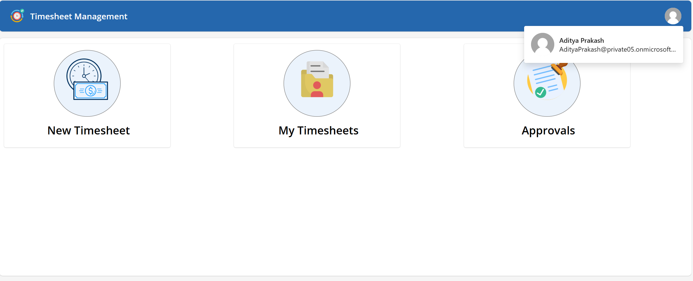
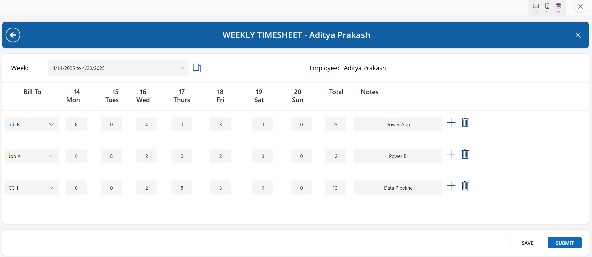
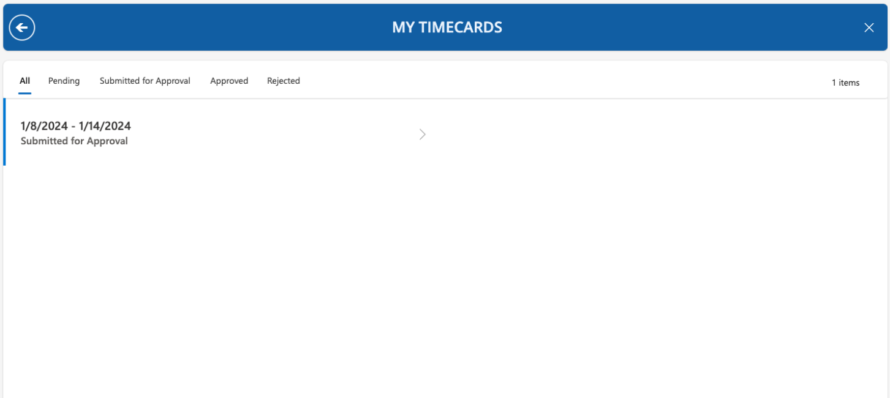
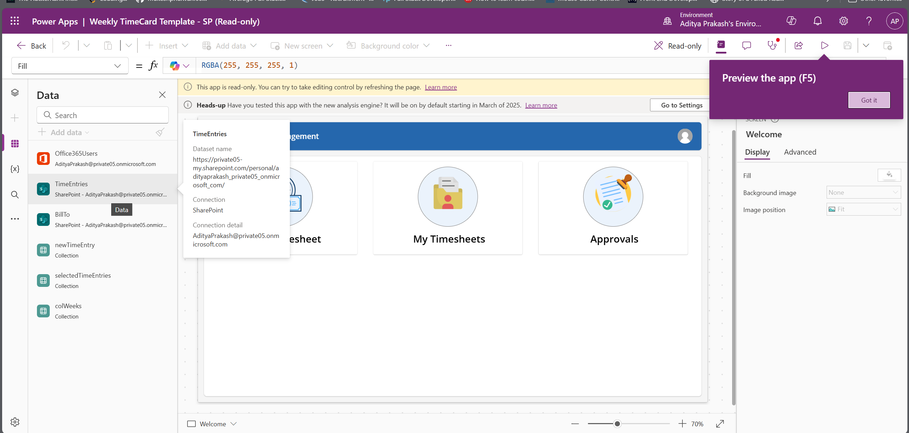

# weekly-timesheet-sharepoint
 
## Features

This sample illustrates how to implement a weekly timesheet application using Power Apps.  The solution consists of a canvas app and utilizes modern controls, named formulas and containers. 

### Key Features of the solution include:
* The ability to submit time cards in a weekly view

* View all submitted time cards and their status as an employee

* Have a manager view to see your team's time cards and approve
* The sample uses SharePoint as the back end so no additional license is required but can be easily adapted to use Dataverse

## Data Sources

* SharePoint

## Step 1: Setup the lists
The first list is **BillTo**, which is a reference list to store what to assign the time to.  This is customizable to whatever you want to assign the time to. For example, this can be to a particular customer, a project, or to a type of time (overtime, regular, etc). 

| **List Column** | **Data Type** | **Notes** |
| --- | --- | --- |
| Title |Single line of text |Default column, used for BillTo name |

The second list is **TimeEntries** which is the main list that stores all of the timesheet data.

| **List Column** | **Data Type** | **Notes** |
| --- | --- | --- |
| Title |Single line of text |Default column, used for project name |
| Comments |Multiple lines of text | |
| Manager Comments |Multiple lines of text | |
| EmployeeTxt |Single lines of text | |
| Status |Choice |Values: Pending, Submitted for Approval, Approved, Rejected |
| Week Start |Date | |
| Employee |Person or Group | |
| Manager |Person or Group | |
| Mon |Number | |
| Tues |Number | |
| Weds |Number | |
| Thurs |Number | |
| Fri |Number | |
| Sat |Number | |
| Sun |Number | |
| Total |Number | |
| BillTo |Lookup | BillTo List, Title Column|

## Installation

* [Download](./WeeklyTimesheet_20250416050557.zip) the `.zip`.
* Within **Power Apps Studio**, import the app `.zip` file using **Apps** > **Import Apps** and select the `.zip` file you just packed.
* Open the Timesheet Template app in Edit mode
* Go to the datasources tab and remove the BillTo and TimeEntries tables

* In the datasources tab, click add new and search for SharePoint
* Navigate to where you created the lists and add the TimeEntries and BillTo list to your app
* Save and Publish

---
